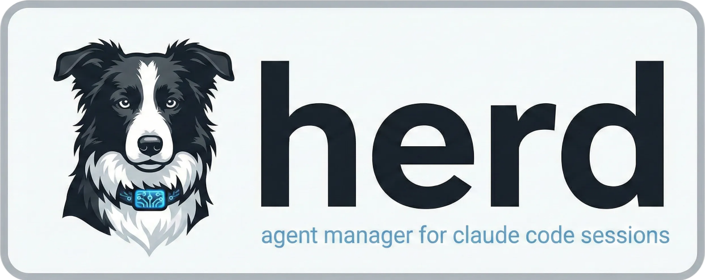

<p align="center">
  
</p>

<!-- <h1 align="center">Herd</h1> -->

<p align="center">
  <strong>Run multiple Claude Code sessions. Stay on top of all of them.</strong>
</p>

<p align="center">
  <a href="#install">Install</a> &middot;
  <a href="#features">Features</a> &middot;
  <a href="#keybindings">Keybindings</a> &middot;
  <a href="#terminals">Terminals</a> &middot;
  <a href="#git-worktrees">Git worktrees</a> &middot;
  <a href="#profiles">Profiles</a> &middot;
  <a href="#how-it-works">How it works</a>
</p>

<!-- --- -->

<!-- TODO: Replace with VHS recording -->
<!-- <p align="center">
  
</p> -->

---

Herd is a terminal UI for running multiple [Claude Code](https://docs.anthropic.com/en/docs/claude-code) sessions and scratch terminals side by side, grouped by project. Switch between them instantly, see which ones need your attention, and never lose a session to a crashed terminal again.

Ships as a single binary. No config files, no daemon, no setup.

## Install

### Homebrew

```bash
brew tap allenan/tap
brew install herd
```

### From source

```bash
git clone https://github.com/allenan/herd.git
cd herd
make build
./herd
```

Requires Go 1.24+ and tmux.

## Features

**Instant session switching** &mdash; Create Claude Code sessions and flip between them with a keystroke. Each session runs in its own isolated pane.

**Project grouping** &mdash; Sessions are automatically grouped by git repo. Collapse and expand project groups to keep the sidebar manageable.

**Status at a glance** &mdash; See which sessions are running, idle, waiting for input, or finished without switching to them.

| Indicator | Claude sessions | Terminal sessions |
| --------- | --------------- | ----------------- |
| spinner   | Running         | Command executing |
| `!`       | Needs input     | &mdash;           |
| `●` gray  | Idle            | Shell idle        |
| `✓`       | Done            | &mdash;           |
| `◉` green | &mdash;         | Service listening |
| `x`       | Exited          | Exited            |

**Project-scoped terminals** &mdash; Press `t` to open a shell in the current project's directory. Terminals show what's running and automatically detect services listening on ports.

**Sessions survive everything** &mdash; Quit herd, close your terminal, reboot your machine. Your Claude Code sessions keep running. Relaunch `herd` and they're all still there.

**Git worktree integration** &mdash; Spin up a session on an isolated branch with `w`. Herd creates the worktree and launches Claude Code in it.

## Keybindings

### Sidebar

| Key       | Action                        |
| --------- | ----------------------------- |
| `j` / `k` | Navigate up/down              |
| `Enter`   | Switch to session             |
| `Space`   | Collapse/expand project       |
| `n`       | New session                   |
| `N`       | New session (pick directory)  |
| `w`       | New session with git worktree |
| `t`       | New terminal                  |
| `d`       | Delete session                |
| `q`       | Quit (sessions keep running)  |

### Pane navigation

| Key                        | Action                |
| -------------------------- | --------------------- |
| `Ctrl-h` / `Ctrl-Left`    | Focus sidebar         |
| `Ctrl-l` / `Ctrl-Right`   | Focus viewport        |

Mouse click also switches focus. Everything in the viewport passes through to Claude Code.

## Terminals

Sometimes you need a plain shell alongside your Claude Code sessions &mdash; for running a dev server, tailing logs, or quick git commands. Press `t` and herd opens a terminal in the current project's directory.

Terminals appear in the sidebar after Claude sessions, prefixed with `$`:

```
▼ myproject           (3)
    Fix auth bug        ✓
    Refactor tests      ●
    $ shell             ●    ← idle terminal
```

### Smart status detection

Herd watches what's running in your terminal and updates the sidebar automatically:

- **Idle shell** &mdash; `● $ shell` &mdash; nothing running, shell prompt visible
- **Running command** &mdash; spinner `$ node` &mdash; shows the process name
- **Service detected** &mdash; `◉  $ :3000` &mdash; a process is listening on a TCP port

Port detection works by walking the process tree of the terminal pane and checking for TCP LISTEN sockets. When you start a dev server (`npm run dev`, `python -m http.server`, etc.), the sidebar updates within a few seconds to show the port.

### Creating and deleting terminals

1. Select any session or project header in the sidebar
2. Press `t`

The terminal opens immediately in the selected project's directory. Delete it with `d` like any other session.

## Git worktrees

Git normally only lets you have one branch checked out at a time. If you're working on a feature and need to switch to a hotfix, you have to stash or commit your work, switch branches, then switch back when you're done. Git worktrees solve this by letting you check out multiple branches simultaneously, each in its own directory — so you can work on `feature/auth` and `hotfix/login` at the same time without touching each other.

Herd makes this a one-keystroke operation. Press `w`, type a branch name, and herd creates the worktree and launches a Claude Code session in it. When you're done, delete the session with `d` and herd cleans up the worktree too.

### Creating a worktree session

1. Select any session or project header in the sidebar
2. Press `w`
3. Type a branch name (e.g. `feature/auth`) and press Enter

Herd will:

- Create a worktree at `<repo>/.worktrees/<branch>` with that branch checked out
- Launch a new Claude Code session in that directory
- Switch you to the new session immediately

The new session appears in the sidebar under its project with a `⎇` prefix to distinguish it from regular sessions:

```
▼ myproject            (3)
    main session        ●
  ⎇ feature/auth        ●
  ⎇ hotfix/login        ✓
```

If the branch already exists (e.g. a remote branch), herd checks it out. If it doesn't exist, herd creates it from the current HEAD.

### Working in a worktree session

Once created, a worktree session works exactly like any other herd session. Claude Code runs in the worktree directory and sees the branch you specified. Changes you make are completely isolated from your main checkout and from other worktrees.

You can switch between worktree sessions and regular sessions freely — they're all just entries in the sidebar.

### Cleaning up

When you're done with a worktree session, select it and press `d`. Herd will:

1. Kill the Claude Code session
2. Remove the git worktree (`git worktree remove`)
3. Clean up stale worktree references (`git worktree prune`)

The branch itself is **not** deleted — only the worktree directory. If you've merged or pushed the branch, you can delete it through git as you normally would.

> **Note:** If herd is killed unexpectedly, orphaned worktree directories may be left behind in `<repo>/.worktrees/`. You can clean these up manually with `git worktree prune` from the repo root.

## Profiles

If you use multiple Claude Code accounts (e.g. personal and work), profiles let you run fully isolated herd instances — each with its own sessions, state, and tmux server.

```bash
herd                  # default profile, uses ~/.herd/
herd --profile work   # "work" profile, uses ~/.herd/profiles/work/
```

Each profile is completely independent. You can run them simultaneously in separate terminals.

### How it works

Named profiles automatically set `CLAUDE_CONFIG_DIR` on the tmux server, so all sessions in that profile inherit it. For example, `herd --profile work` sets `CLAUDE_CONFIG_DIR=~/.claude-work` — no additional configuration needed.

This is equivalent to running `CLAUDE_CONFIG_DIR=~/.claude-work claude` manually, but herd handles it for you.

### Setting up a profile

On first launch, `herd --profile work` automatically creates its directory and a `config.json`:

```
~/.herd/profiles/work/
├── config.json      # {"claude_config_dir": "/Users/you/.claude-work"}
├── state.json
├── tmux.sock
└── debug.log
```

To use a different config directory, edit the config:

```json
{"claude_config_dir": "/path/to/custom/claude-config"}
```

The default profile (`herd` with no `--profile` flag) does not set `CLAUDE_CONFIG_DIR`, so Claude Code uses its standard `~/.claude` directory.

### Quick access

Add a shell alias for convenience:

```bash
alias herd-work="herd --profile work"
```

### Makefile targets

Makefile commands accept a `PROFILE` variable:

```bash
make run PROFILE=work      # build + run with --profile work
make kill PROFILE=work     # kill only the work profile's tmux server
make reload PROFILE=work   # hot-swap the work profile's sidebar
```

## How it works

Herd uses tmux as a PTY multiplexer behind the scenes &mdash; you never interact with tmux directly. When you run `herd`:

1. A dedicated tmux server starts on its own socket (`~/.herd/tmux.sock`), isolated from your normal tmux
2. A two-pane layout is created: sidebar (left) + viewport (right)
3. The sidebar runs a [Bubble Tea](https://github.com/charmbracelet/bubbletea) TUI for navigation
4. Each Claude Code session is a tmux window that gets swapped into the viewport when selected

State is persisted to `~/.herd/state.json`. A reconciliation loop runs every 2 seconds to sync state with live tmux panes &mdash; if state gets corrupted or deleted, sessions are automatically recovered.

## Requirements

- **tmux** &mdash; installed automatically via Homebrew, or `apt install tmux` / `dnf install tmux` on Linux
- **Claude Code** &mdash; [install instructions](https://docs.anthropic.com/en/docs/claude-code)

## License

MIT
